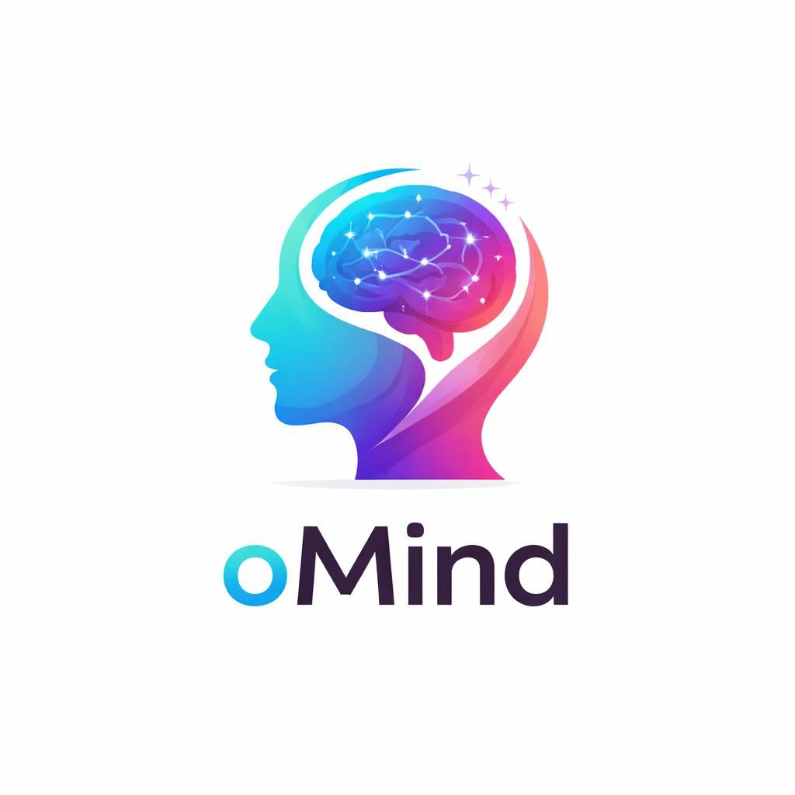

<div align="center">

<!-- LOGO -->


# 🧠 oMind

### Framework for Knowledge Grounded Finetuning and Multi-Turn Dialogue Benchmark for Mental Health LLMs

*Indian Institute of Technology Bombay · arXiv 2603.25105 · 2026*

[](https://arxiv.org/abs/2603.25105)
[](https://github.com/surajrachaiitb/oMind)
[](https://huggingface.co/surajracha/oMind-Mistral/)
[](https://huggingface.co/surajracha/oMind-Qwen/)
[](https://huggingface.co/surajracha/oMind-Llama/)
[](https://huggingface.co/datasets/surajracha/oMind-Chat/)

</div>

---

## Overview

**oMind** (Overall Mind) is a comprehensive framework for adapting Large Language Models to the mental health domain. We address three core bottlenecks:

1. **Lack of high-quality, interpretable, knowledge-grounded training data** for mental health
2. **Training paradigms restricted to core capabilities** (e.g., classification), missing open-ended and conversational tasks
3. **Absence of robust multi-turn dialogue evaluation benchmarks** for mental health

oMind provides an end-to-end solution spanning knowledge-grounded dataset curation, multi-task model finetuning, DPO preference alignment, and expert-annotated benchmarking.

---

## 🗂️ Framework Components

### 1. 🧬 oMind-SFT Dataset
A **~164k multi-task instruction dataset** grounded in structured medical knowledge:
- Retrieval from **UMLS knowledge graph** + psychology books (DSM-5, ICD-11) via BM25 + BERT Embedding
- LLM-based pruning via GPT-4o-mini to retain only query-relevant knowledge
- NLI-based review using RoBERTa to detect and remove contradictions (threshold 0.8)
- Tasks: MCQA · Disorder Classification · Root Cause Identification · Open-Ended QA (~57k) · Multi-Turn Conversations (~37.5k)

### 2. 🤖 oMind-LLMs
Specialized mental health LLM agents finetuned via **LoRA** and aligned via **DPO**:

| Model | Base | HuggingFace |
|---|---|---|
| oMind-Llama | Llama-3.1-8B | [🤗 surajracha/oMind-Llama](https://huggingface.co/surajracha/oMind-Llama/) |
| oMind-Mistral | Mistral-7B-v3 | [🤗 surajracha/oMind-Mistral](https://huggingface.co/surajracha/oMind-Mistral/) |
| oMind-Qwen | Qwen-2.5-7B | [🤗 surajracha/oMind-Qwen](https://huggingface.co/surajracha/oMind-Qwen/) |

### 3. 💬 oMind-Chat Benchmark
A **novel multi-turn conversation benchmark** with expert-annotated rubrics ([🤗 surajracha/oMind-Chat](https://huggingface.co/datasets/surajracha/oMind-Chat/)):
- **961 conversation instances** (535 single-turn + 426 three-turn)
- **1,809 total user-bot dialogue turns**
- Annotated by **4 psychology domain experts** (minimum Master's qualification)
- Dual-level rubrics: **turn-level** (2–5 elements per turn) and **conversation-level** (3–10 bullet points)
- Three evaluation metrics: Binary Coverage · 0–10 Scale · Likert (1–5)

---

## 🚀 Quick Start

### Installation

```bash
git clone https://github.com/surajrachaiitb/oMind.git
cd oMind
pip install -r requirements.txt
```

### Load a Pretrained oMind Model

```python
from transformers import AutoTokenizer, AutoModelForCausalLM

# Choose from: surajracha/oMind-Qwen, surajracha/oMind-Mistral, surajracha/oMind-Llama
model_name = "surajracha/oMind-Qwen"

tokenizer = AutoTokenizer.from_pretrained(model_name)
model = AutoModelForCausalLM.from_pretrained(model_name)

prompt = "I've been feeling anxious and overwhelmed lately. What could be causing this?"
inputs = tokenizer(prompt, return_tensors="pt")
outputs = model.generate(**inputs, max_new_tokens=256)
print(tokenizer.decode(outputs[0], skip_special_tokens=True))
```

### Load the oMind-Chat Benchmark

```python
from datasets import load_dataset

benchmark = load_dataset("surajracha/oMind-Chat")
print(benchmark)
# Each instance contains multi-turn user queries with turn-level and conversation-level rubrics
```

---

## 🏗️ Generation Pipeline

```
Input Query (MCQA / Classification / Long-form)
        │
        ▼
┌──────────────────────────┐
│      Retrieval Stage     │  ← BM25 (sparse) + BERT Embedding (dense)
│  UMLS KG + DSM-5/ICD-11  │     Top-10 triplets + book chunks per query
└──────────────────────────┘
        │
        ▼
┌──────────────────────────┐
│  Pruning & Generation    │  ← GPT-4o-mini as pruning + generation agent
│        Stage             │     Targets: reasoning, factual explanation, comparison
└──────────────────────────┘
        │
        ▼
┌──────────────────────────┐
│      Review Stage        │  ← RoBERTa NLI (sentence-level classification)
│  Entailed / Neutral /    │     Remove contradictions above threshold 0.8
│     Contradicted         │     Regenerate if >2 sentences contradict
└──────────────────────────┘
        │
        ▼
   Grounded Explanation (E)
        │
   ┌────┴────┐
   ▼         ▼
Support QA  Multi-Turn Conversations
  (~57k)      (~37.5k, 3–5 turns)
```

---

## 📊 Main Results

### Core Capabilities (F1 Score %)

| Model | Classification AVG | MCQA AVG |
|---|---|---|
| Llama 3.1 8B (Zero Shot) | 43.7 | 72.3 |
| Mistral 7B (Zero Shot) | 48.0 | 64.7 |
| Qwen 2.5 7B (Zero Shot) | 45.4 | 67.3 |
| MentaLLaMA 13B (Zero Shot) | 54.3 | 53.3 |
| **oMind-Llama** | 48.8 *(+5.1)* | 63.1 |
| **oMind-Mistral** | **57.2** *(+9.2)* | 67.6 |
| **oMind-Qwen** | 40.6 | **70.9** *(+3.6)* |

### Conversation Performance on oMind-Chat

| Model | Turn Binary | Turn 0-10 | Turn Likert | Conv Binary | Conv 0-10 | Conv Likert |
|---|---|---|---|---|---|---|
| Llama 3.1 8B | 0.64 | 5.2 | 3.7 | 0.76 | 6.2 | 3.9 |
| Mistral 7B | 0.61 | 4.9 | 3.7 | 0.76 | 6.0 | 3.9 |
| Qwen 2.5 7B | 0.60 | 4.8 | 3.7 | 0.74 | 5.9 | 3.9 |
| oMind-Llama | 0.56 | 4.5 | 3.3 | 0.64 | 5.0 | 3.5 |
| oMind-Mistral | 0.63 | 5.1 | 3.7 | 0.73 | 5.8 | 3.9 |
| **oMind-Qwen** | **0.73** | **6.0** | **4.0** | **0.79** | **6.5** | **4.1** |

### Explanation Win Rate vs. Base LLMs (GPT-as-a-judge)

| Comparison | Win % | Tie % | Lose % |
|---|---|---|---|
| oMind-Llama vs Llama | 77.0 | 10.5 | 12.5 |
| oMind-Mistral vs Mistral | 76.0 | 23.0 | 1.0 |
| **oMind-Qwen vs Qwen** | **80.0** | 4.0 | 16.0 |
| oMind-Mistral-DPO vs Mistral | 87.0 | 1.5 | 11.5 |
| oMind-Qwen-DPO vs Qwen | 84.0 | 7.5 | 8.5 |

---

## 🗃️ Dataset Statistics

| Type | Dataset | # Train | # Test |
|---|---|---|---|
| MCQA | MHQA | 25,000 | 500 |
| MCQA | MedMCQA | 2,750 | 594 |
| MCQA | MMLU-hsp | 441 | 150 |
| MCQA | MMLU-pp | 462 | 150 |
| MCQA | USMLE-Mental | 498 | 219 |
| Disorder | ANGST | 6,990 | 500 |
| Disorder | Dreaddit | 2,975 | 533 |
| Root Cause | CAMS | 1,666 | 290 |
| Root Cause | SAD | 5,479 | 500 |
| Conversation | ESConv | 910 | — |
| Conversation | MentalChat 16k | 12,867 | — |
| Conversation | CounselLMe | 160 | — |

---

## ⚙️ Training Details

| Setting | Value |
|---|---|
| Finetuning method | LoRA |
| Epochs | 2 |
| Learning rate | 5 × 10⁻⁵ |
| Weight decay | 0.01 |
| Preference alignment | DPO (20k pairs) |
| DPO unseen instances | 10k (held out from SFT) |
| Judge for win rate | GPT-as-a-judge (200 instances / comparison) |

---

## 👥 Authors

Suraj Racha · Prashant Harish Joshi · Utkarsh Maurya · Nitin Yadav · Mridul Sharma · Ananya Kunisetty · Saranya Darisipudi · Nirmal Punjabi · Ganesh Ramakrishnan

**Indian Institute of Technology Bombay**
📧 `23d1627@iitb.ac.in` · `npunjabi@iitb.ac.in` · `ganesh@cse.iitb.ac.in`

---

## 📝 Citation

If you use oMind in your research, please cite:

```bibtex
@article{racha2026omind,
  title   = {oMind: Framework for Knowledge Grounded Finetuning and Multi-Turn Dialogue Benchmark for Mental Health LLMs},
  author  = {Racha, Suraj and Joshi, Prashant Harish and Maurya, Utkarsh and Yadav, Nitin and Sharma, Mridul and Kunisetty, Ananya and Darisipudi, Saranya and Punjabi, Nirmal and Ramakrishnan, Ganesh},
  journal = {arXiv preprint arXiv:2603.25105},
  year    = {2026}
}
```

---

## ⚠️ Ethical Statement

oMind is a **research framework** for studying LLM performance across mental health evaluations. The models are designed as **decision-support tools** and are **not intended to replace professional mental health experts** or for standalone real-world deployment.

---

## 📄 License

This project is licensed under the MIT License. See [LICENSE](LICENSE) for details.

---

<div align="center">
<sub>Built with ❤️ at KCDH, IIT Bombay · For responsible AI in mental health</sub>
</div>